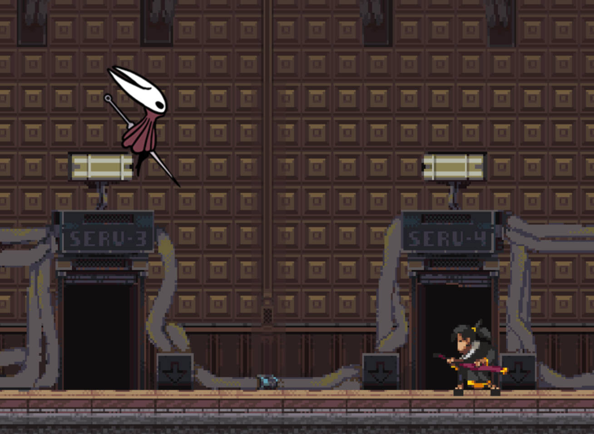
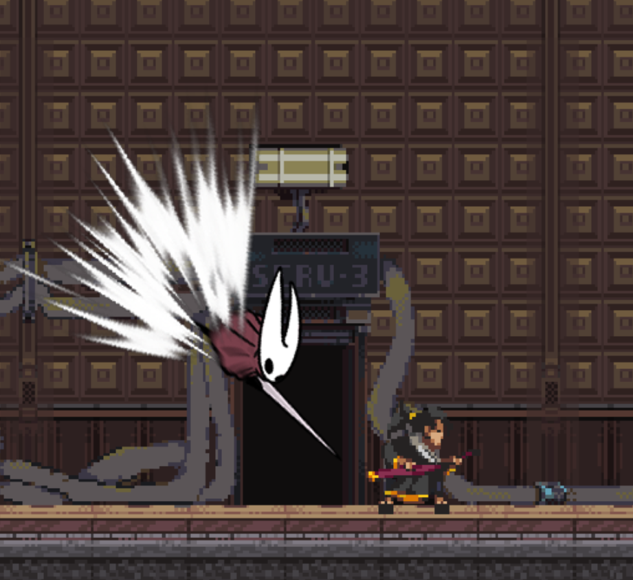
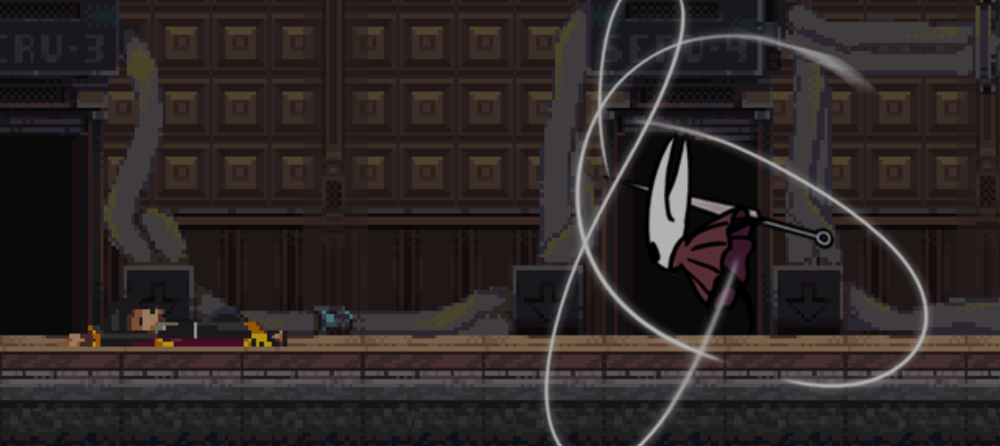

# 2D单人格斗
这是个与简易ai进行格斗的单人游戏，游戏名称暂定为《武士 pk 空洞》，如果你有兴趣，也可以取一个无敌牛逼好听，或者朗朗上口的名字。
此游戏由作者结合b站Voidmatrix博主的教学视频，使用了SDL2进行开发，请不要对此游戏抱有过多的期待。

## 效果图

##  构建
在Linux平台上，请先确认你已经安装了SDL2库，然后在游戏源码根目录中使用命令：
mkdir build && cd build
cmake ..
make
##  运行
./bin/game-Linux

## 玩家操作
w--跳跃   s--翻滚  a--向左移动  d--向右移动  鼠标左键--攻击  鼠标右键--子弹时间  o--碰撞箱可视化切换  Esc--退出游戏  F11--全屏/半屏切换
翻滚期间无敌  攻击朝向根据角色与鼠标相对位置
